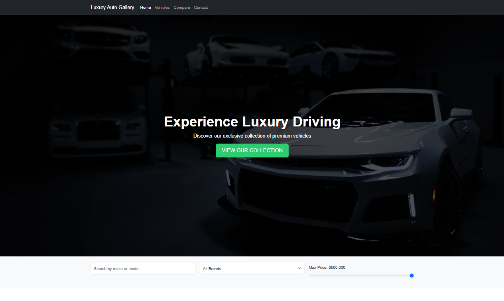

# 🚗 Luxury Auto Gallery – Premium Vehicle Showcase Website

## 📋 Project Overview
**Luxury Auto Gallery** is a sophisticated web platform designed to showcase and explore luxury vehicles. The project focuses on creating an elegant and user-friendly interface for browsing high-end automobiles, comparing different models, and connecting potential buyers with exclusive vehicles.

The main goal is to provide a premium digital experience that matches the luxury standards of the vehicles being showcased.

---

## 🚀 Live Demo
🔗 [View Project Live]([https://ahmednader112200@gmail.com/Luxury-Auto-Gallery/](https://ahmednaderhq.github.io/Luxury-Driving/))

---

## 📷 Preview


---

## 🎯 Key Features

### 🏠 Home Page
- Hero section with call-to-action
- Dynamic vehicle showcase
- Advanced search and filtering system
- Interactive vehicle comparison tool
- Contact form with vehicle selection
- Social media integration

### 🚘 Vehicle Features
- Detailed vehicle listings
- Brand-based filtering
- Price range filtering
- Vehicle comparison system
- Vehicle details modal
- Test drive scheduling

### 📱 User Interface
- Responsive navigation
- Modern design elements
- Interactive components
- Social media links
- Contact information
- Mobile-friendly layout

---

## 🛠️ Technologies Used

**Frontend:**
- HTML5 – Structure
- CSS3 – Styling & Layout
- JavaScript (ES6+) – Interactivity
- Bootstrap 5.3.2 – Responsive design
- Font Awesome 6.0 – Icons

**Libraries:**
- Bootstrap Bundle – Interactive components
- Font Awesome Icons – UI elements

---

## 📂 Project Structure

```
project/
├── 📄 index.html
├── 📄 styles.css
├── 📄 script.js
├── 📄 README.md
└── 📁 images/
    ├── photo-1492144534655-ae79c964c9d7.jpg
    ├── photo-1503376780353-7e6692767b70.jpg
    ├── photo-1555215695-3004980ad54e.jpg
    ├── photo-1580273916550-e323be2ae537.png
    └── photo-1619682817481-e994891cd1f5.jpg
```

## 👨‍💻 Development Team

- Ahmed Nader
  - [GitHub](https://github.com/AhmedNaderHQ)
  - [LinkedIn](https://www.linkedin.com/in/ahmed-nader-8a0a2529a)
  - [Facebook](https://www.facebook.com/share/1JURvC96xV/)

---

## 📱 Responsive Design
- Desktop 💻
- Tablet 📱
- Mobile 📲

## 📞 Contact Information
- 📍 Location: Mansoura, Egypt
- 📞 Phone: +20 102 735 3688
- ✉️ Email: ahmednader112200@gmail.com

---

© 2024 Ahmed Nader. All rights reserved.


